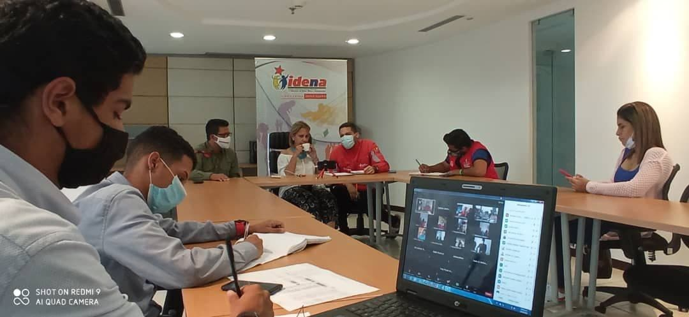
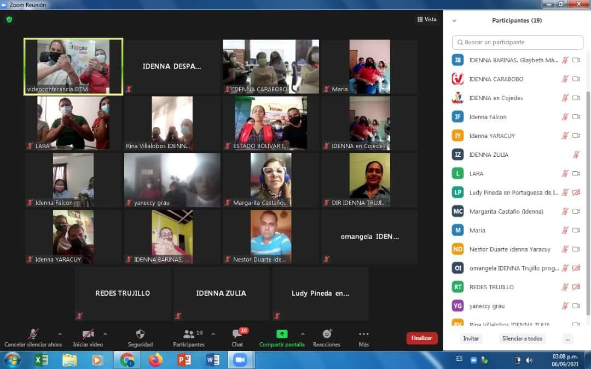

Con motivo del lanzamiento del plan de ofensiva social "IDENNA Contigo" la presidenta del Instituto Autónomo Consejo Nacional de Derechos de Niños, Niñas y Adolescentes (IDENNA) Dra. Luisaura Ravicini realizó hoy lunes 06 de septiembre de 2021 un Directorio Ampliado con el fin de girar instrucciones a las diferentes Direcciones Estadales en cuanto a la territorialización de la gestión se refiere. Dentro de los temas tratados se encuentra la puesta en marcha de los Círculos de Crianza Amorosa, que según lo mencionado por la Dra. Ravicini " deben surgir del seno de cada sector popular, de cada urbanismo, de cada calle..." y deben significar una fuerza organizativa que exalte el amor como elemento vital para la transformación social.

En dicho encuentro también participaron Alejandro Raga Gerente General, el Dr. Luiyer Barreto Guevara Director del Despacho y Miguel Franco Coordinador Nacional de Redes Sociales, quienes también generaron aportes que permitieron desarrollar un intercambio de ideas originando de esta forma un espacio de construcción colectiva de cara al proceso de fortalecimiento de la gestión institucional y política.

.jpg)

Por último se anunció el relanzamiento de algunos programas preventivos que contribuirán a potenciar el trabajo que desarrolla día a día la familia del IDENNA a lo largo y ancho del territorio nacional. 

Fuente: Prensa IDENNA

