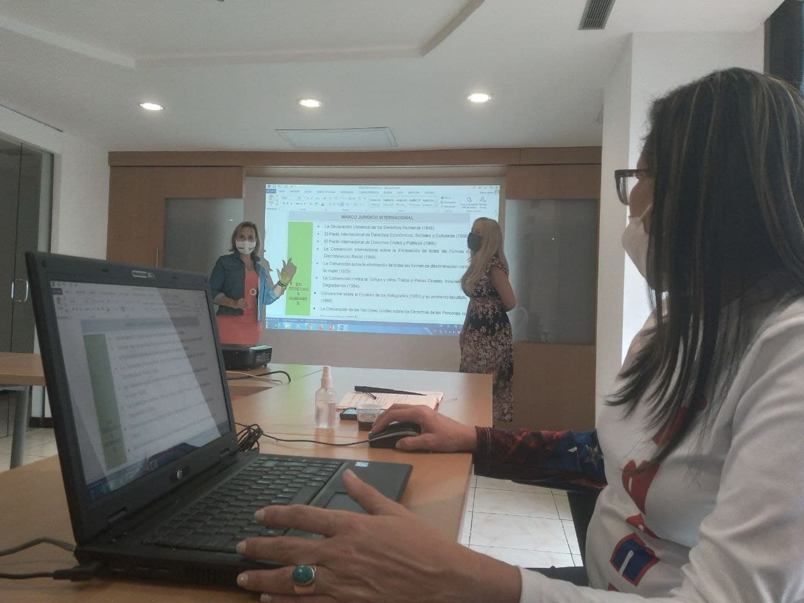
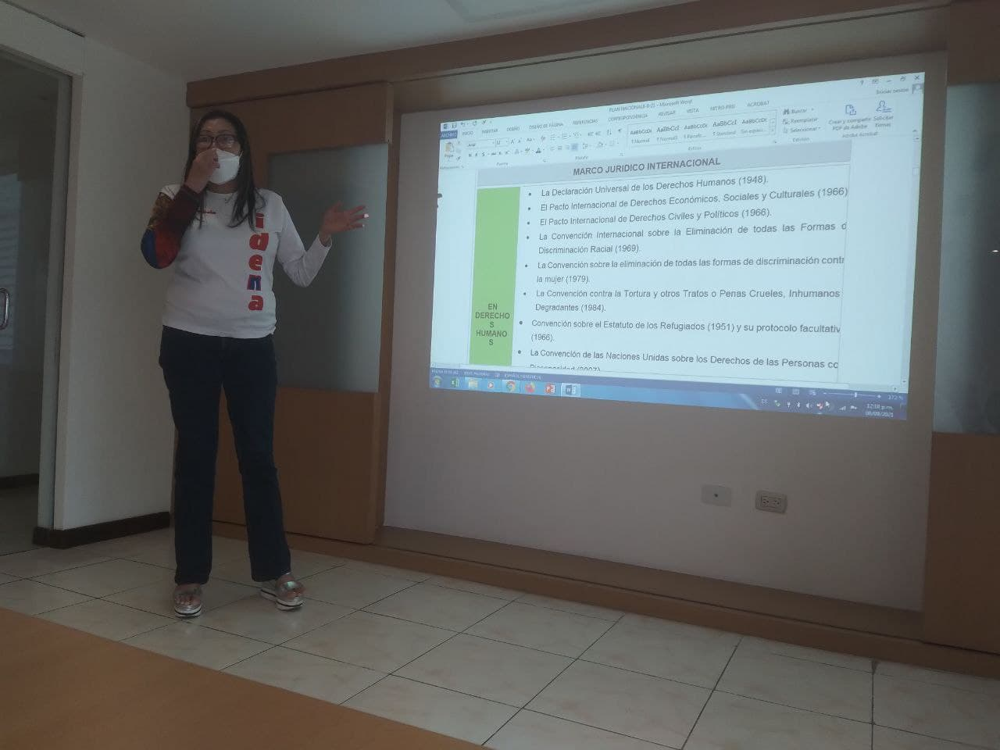

Con motivo del lanzamiento del Plan Nacional para la Protección Integral de Niños, Niñas y Adolescentes, la Presidenta del Instituto Autónomo  Consejo Nacional de Derechos de Niños, Niñas y Adolescentes (IDENNA) Dra. Luisaura Ravicini realizó hoy miércoles 08 de septiembre de 2021 una reunión aclarando últimos detalles  a fin de realizar la planificación de este plan con el fin de girar instrucciones a las Direcciones Estadales en cuanto a  dar inicio a un conjunto de acciones y esfuerzos de coordinación  por parte del Sistema Rector  con la institucionalidad Pública para promover programas, servicios y acciones efectivas en materia de protección integral. 

En dicho encuentro también  participaron la Dra Yris Valera Asesora Externa, Aiskel Zurita Gerente de Asuntos Internacionales y Maria Garcia Asesora Externa, quienes son parte del órgano asesor del IDENNA quienes desarrollaron un intercambio de ideas con un trabajo intergerencial y un equipo multidisciplinario.

