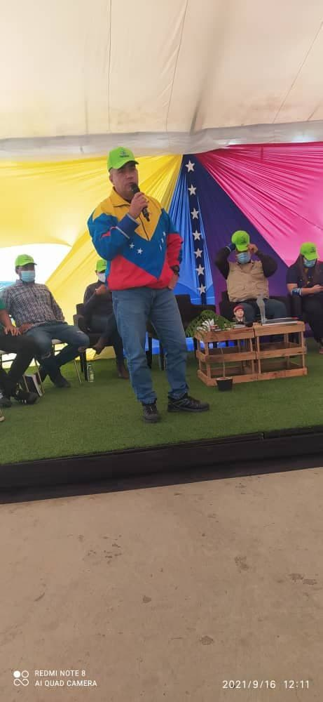

El día de hoy se desarrolló el lanzamiento del Programa "Guardianes del Árbol" en el Complejo Urbanístico de la Gran Misión Vivienda Venezuela ubicada en Ciudad Tiuna, por parte del Ministerio del Poder Popular para el Ecosocialismo (MINEC) a través de la Misión Árbol,  el cual  busca la atención de niños, niñas y adolescentes, potenciando las líneas de acción ecosocialistas,  emananadas por el Ejecutivo Nacional y designadas a este ministerio como órgano rector en la materia; por parte del IDENNA en la actividad se contó con la participación de la Lcda. Sonia Quintero  (Gerente Nacional de Programa) quien manifestó, que la jornada había sido espectacular, siendo está una iniciativa del Presidente de la República, en el cuál se está enseñando a los niños a partir de los 3 años, a amar la naturaleza. Resaltó que con los procesos que vive el planeta, es importante enseñarles a los niños y niñas desde pequeños, a amar la tierra, amar los árboles, que son los que nos brindan oxígeno, ya que esto va a permitir un mejor sistema de vida. 

De igual forma la Licenciada destacó, que el IDENNA está dispuesto y abocado a apoyar y hacer seguimiento a este programa junto a la Misión Árbol, todo ello desde las Casas de Abrigo, enseñar a nuestros niños y niñas a que se monten en ese autobús de amar la tierra,  amar la naturaleza; de igual forma informó que desde la presidencia de la institución, se están estableciendo los enlaces necesarios con los directores a nivel nacional, a fin de llevar a cada rincón de nuestra tierra, ese amor por la naturaleza, enfatizó la funcionaria.

Es importante resaltar que la participación del IDENNA en el lanzamiento de esta política, representa una alianza institucional de gran relevancia, motivado a que ambas instituciones tienen como labor principal la atención de la niñez y la adolescencia, acciones enmarcadas en el Plan IDENNA Contigo,  por lo que la institución abre sus brazos a está nueva propuesta gubernamental, que busca una vez más, elevar la calidad de vida de nuestros niños, niñas y adolescentes a través de la formación y valores, sembrando fe y esperanza y el amor por la Pachamama. 

Fuente: Prensa I
