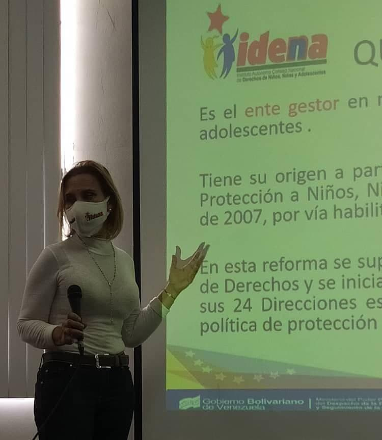

El día de hoy se estableció en el Estado Carabobo Municipio Guacara, un encuentro entre la Presidenta de la institución Dra. Luisaura Ravicini y la Primera Combatiente del Municipio Corina de Castañeda,  con el propósito de visibilizar las políticas y los logros alcanzados desde la institución así como desarrollar medidas pertinentes hacía su fortalecimiento.

.jpg)

Cabe resaltar que esta visita obedece al despliegue planteado por el IDENNA en el marco del Plan "IDENNA Contigo", como propuesta que busca potenciar los esfuerzos en materia de protección de los niños, niñas y adolescentes  en el territorio nacional; dentro de las acciones a ejecutar en este plan, se encuentra la instalación de Puntos de Control  para la Crianza  Amorosa, propiciadas desde la ciudad de Caracas.

.jpg)

Fuente: Prensa IDENNA
