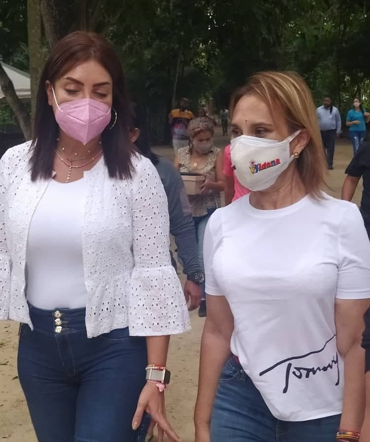
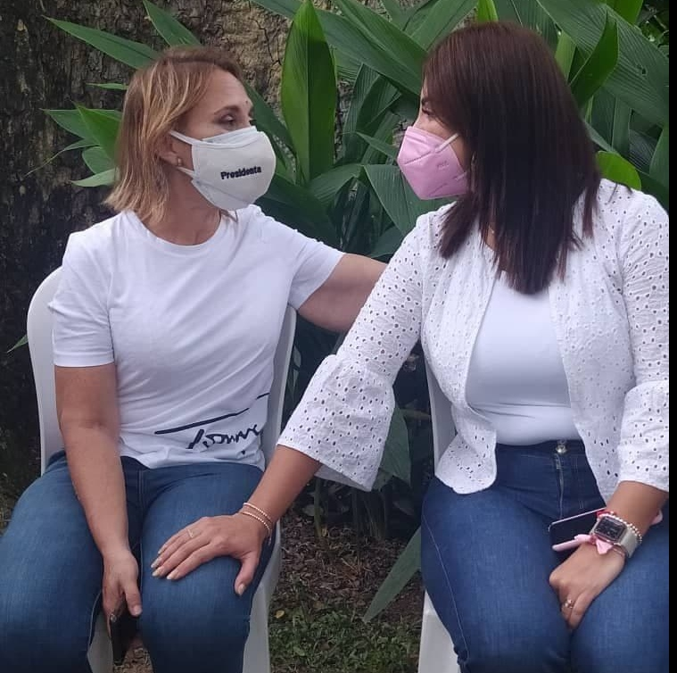

En el marco de la **Campaña IDENNA Contigo**, que tiene como propósito principal el generar el acercamiento de la institución con el Poder Popular, afianzando la gestión en el territorio nacional, se mantiene el despliegue en el estado Carabobo, promoviendo y difundiendo el **Plan de Crianza Amorosa.**

En esta actividad se contó con la participación de la primera combatiente del municipio Naguanagua Diana Caicedo de Gutiérrez, la Candidata a la Alcaldía  por el PSUV Ana González y la presidenta de la institución Dra. Luisaura Ravicini la cual preciso que "para el mes de octubre se iniciará, la avanzada de atención social a través de este Plan, que concibe a la familia como agente transformador de la sociedad y todo lo que la vincula, principalmente desde la relación amorosa y el intercambio de experiencias, partiendo desde el amor y los valores sociales". Con este recorrido se culmina la 1° avanzada de abordaje de recorridos en el Estado Bolivariano de Carabobo, puntualizo la presidenta del IDENNA.

De igual forma la presidenta de la institución indicó a medios de prensa regionales, que para finales del mes de octubre, se estará dando apertura al *]Congreso 2.0 sobre la Crianza Amorosa**, con la participación de ponentes internacionales de alta trayectoria en materia de protección de niños, niñas y adolescentes.

Fuente: Prensa IDENNA
