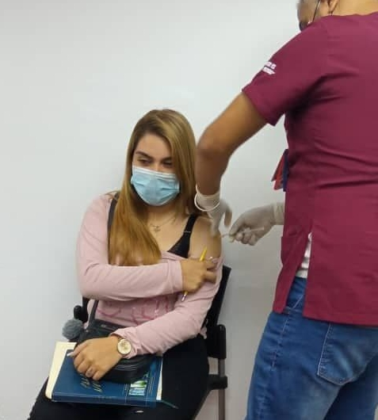
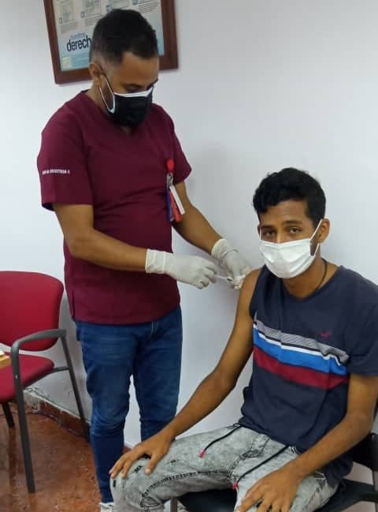
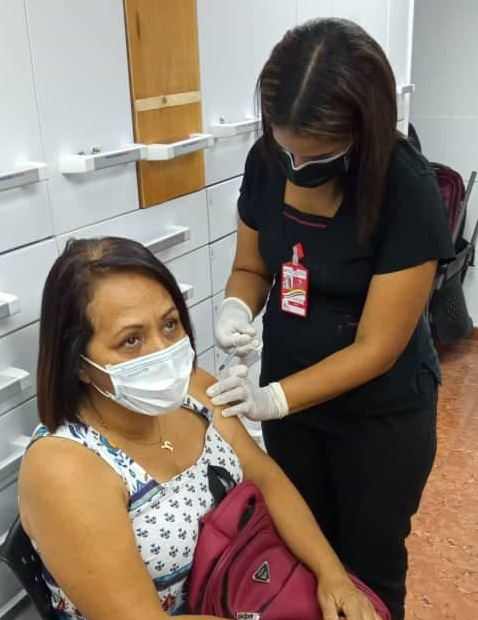

El día de ayer Lunes 27/09/2021 se realizó una Jornada de Vacunación dirigidas a los trabajadores del IDENNA, esta jornada se llevó a cabo en las instalaciones del Palacio de Miraflores y la misma fue instruida por el Ministro del Poder Popular para el Despacho de la Presidencia Cnel. Jorge Elieser Márquez, a través del Viceministro de la Suprema Felicidad Social José Luis Pestana, como parte de las instrucciones emanadas por nuestro Presidente de la República, dando continuidad a la Campaña de Inmunización contra el Covid-19  a la población en general. 

Esta jornada se desarrolló con las medidas de bioseguridad correspondientes, atendiendo a más de 40 trabajadores de la Sede Principal del IDENNA, como parte del compromiso hacía los trabajadores y al público en general atendido en nuestras instalaciones, en la labor diaria desarrollada en la institución, en el  cumplimiento de las funciones atribuidas en materia de protección de niños, niñas y adolescentes.

**Fuente: Prensa IDENNA**
