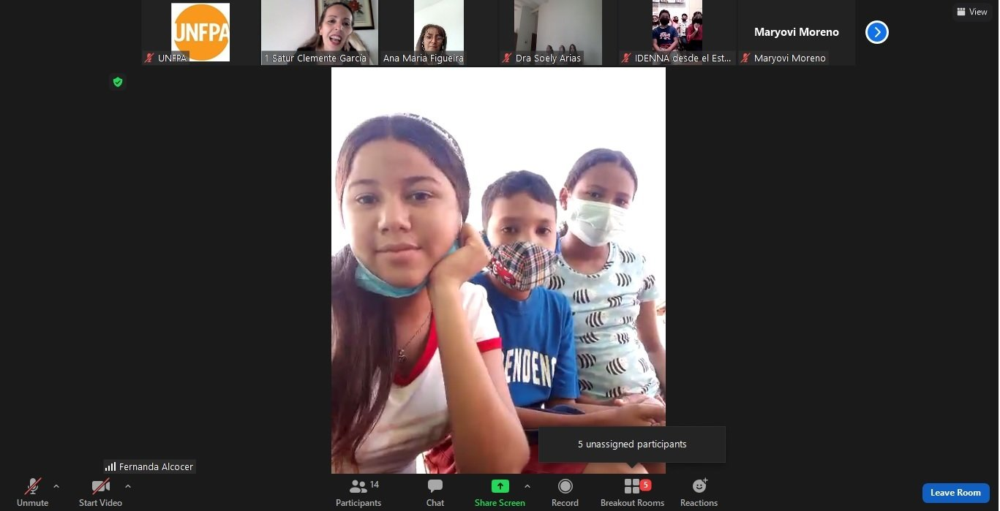

Con motivo del Día Mundial de Prevención del Embarazo No Intencional en Adolescentes, que se conmemora cada 26 de septiembre, el Fondo de Población de las Naciones Unidas en alianza con el Ministerio del Poder Popular para la Educación, el Consejo Consultivo del Plan Nacional de Reducción del Embarazo a Temprana Edad y en la Adolescencia (PRETA), OPS/OMS, UNICEF, el Ministerio del Poder Popular para la Salud y las consultas diferenciadas para adolescentes de todo el país, llevaron a cabo  este 29 de septiembre el evento “Hablemos Claro”, que también contó con la participación del Instituto Autónomo Consejo Nacional de Derechos del Niño, Niña y Adolescentes (IDENNA) y la Universidad Pedagógica Experimental Libertador (UPEL).

Este evento celebrado virtualmente contó con una nutrida y activa participación de adolescentes que asisten a las consultas diferenciadas, que participan en el programa de pares promotores, adolescentes de la Organización Bolivariana de Estudiantes y de los diversos espacios de formación y participación vinculados con adolescentes en todo el país, con el objetivo de conversar sobre temas centrales para la prevención del embarazo en adolescentes, estableciendo un diálogo seguro con especialistas, que además de su formación, han demostrado su compromiso con el pleno desarrollo de las potencialidades de adolescentes y jóvenes.

Se abordaron temas como: Proyecto de vida, violencia contra niñas y adolescentes, planificación familiar y métodos anticonceptivos seguros para adolescentes, derechos sexuales y derechos reproductivos, prevención de infecciones de transmisión sexual (ITS) y VIH. Seguido del intercambio en plenaria de los aspectos más destacados de las discusiones con las y los adolescentes sobre estos temas.

El Consejo Consultivo del Plan Preta propuso celebrar el mes de Prevención del Embarazo en la Adolescencia que será hasta el próximo 29 de octubre cuando se conmemora el Día Nacional.

Otra de las iniciativas llevadas a cabo consistió en una acción digital bajo la modalidad de reto o “challenge”, muy populares en redes sociales como TikTok e Instagram, y convocó a adolescentes de todas partes de Venezuela, que asisten a las 90 consultas diferenciadas en el país, a exponer opciones y expresar sus decisiones frente a situaciones comunes relacionadas con su sexualidad, proyecto de vida y el ejercicio de sus derechos. Este reto promueve la sensibilización entre adolescentes, jóvenes, familia y comunidad, sobre las distintas alternativas anticonceptivas y la importancia de la Educación Integral de la Sexualidad para la prevención del embarazo no planificado en la adolescencia. 

En el perfil de Instragram  [@Unfpa_Venezuela](https://www.instagram.com/unfpa_venezuela/) podrás ver los videos del reto.

Tú también puedes unirte al Mes de Prevención del Embarazo No Intencional en Adolescentes descargando [aquí](https://drive.google.com/drive/folders/1SVlp8sLo4eXjf0My4RWKw-Er2MXIAlMd) la campaña “Hablemos Claro” y ayudando a difundir sus contenidos en Redes Sociales usando el hashtag #HablemosClaro y etiquetando a @UNFPA_Venezuela

También te invitamos a conocer la Campaña impulsada por [UNICEF Venezuela](https://www.instagram.com/unicefvenezuela/)  #HablemosDeFrente #NoEsBromaEsViolencia para visibilizar y sensibilizar sobre la vulnerabilidad de las niñas y mujeres frente a la violencia, y la corresponsabilidad del Estado, la sociedad, las familias y cada persona en la prevención y atención de la violencia.

Seguimos trabajando por incidir en las causas estructurales del embarazo a temprana edad y en la adolescencia y tú puedes contribuir a una nueva forma de pensar este desafío donde las niñas, adolescentes y jóvenes no se conciban como el problema y construyamos una agenda común que nos permita dirigir todos los esfuerzos para erradicar la discriminación, la desigualdad de género, las opiniones negativas que recaen sobre las niñas y mujeres y todas las prácticas nocivas que impiden su pleno desarrollo. 

Fuente: [UNFPA Venezuela](https://venezuela.unfpa.org/es/news/adolescentes-de-todo-el-pa%C3%ADs-se-unen-al-reto-%E2%80%9Cdecisiones%E2%80%9D-por-el-d%C3%ADa-mundial-para-la-prevenci%C3%B3n)
