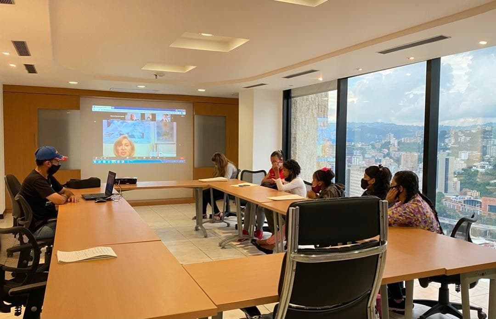
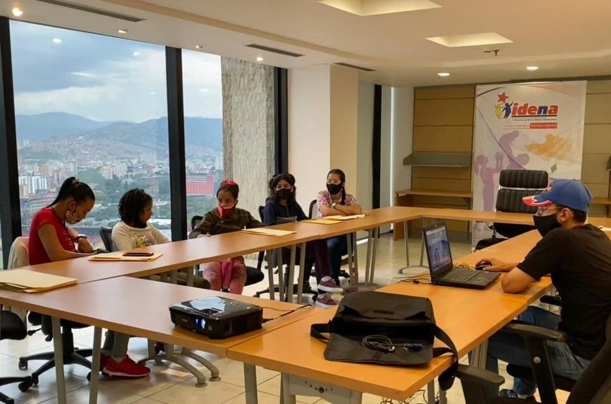
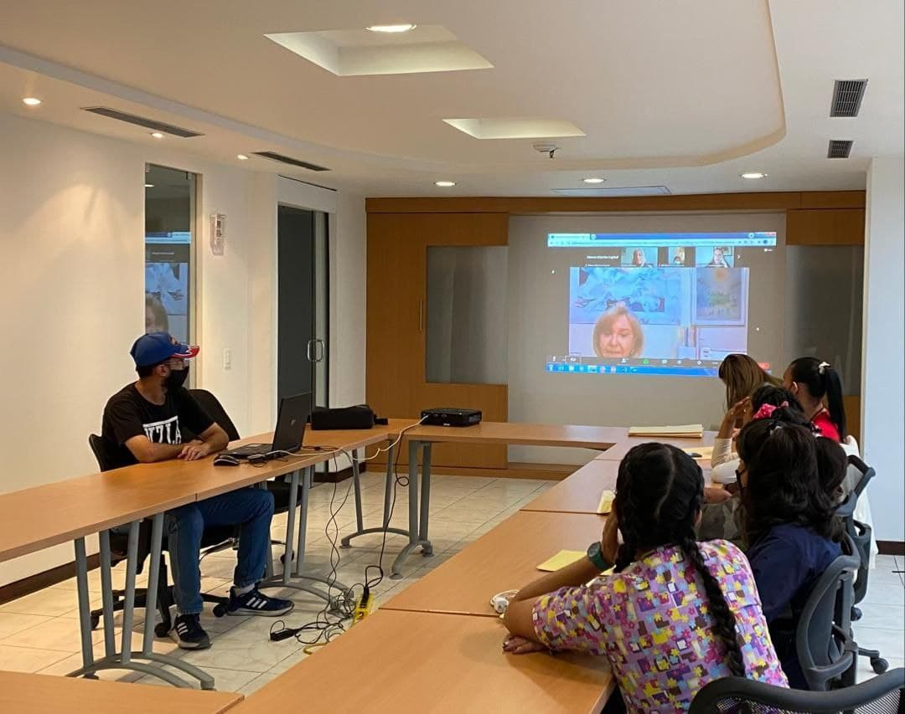

El día de hoy 29/09/2021, se llevó a cabo en la Sede Principal de IDENNA ubicada en Plaza Venezuela, una videoconferencia relacionada al Plan Nacional de Prevención y Reducción de Embarazo a temprana edad en Adolescentes, con la participación de la presidenta del IDENNA  Dra. Luisana Ravicini y del personal de la institución. 

En estas videoconferencia el IDENNA como ente rector en la materia  y vigilante de la Protección Integral de Niños, Niñas y Adolescentes, presentó orientaciones relacionadas a los cuidados y medidas de prevención de los  embarazos a temprana edad, así como también las recomendaciones y la legislación existentes en el país favorables en cuanto a derechos sexuales se refiere, que ampara a nuestros jóvenes, ante cualquier situación que afecte su integridad personal.

**Fuente: Prensa IDENNA**
