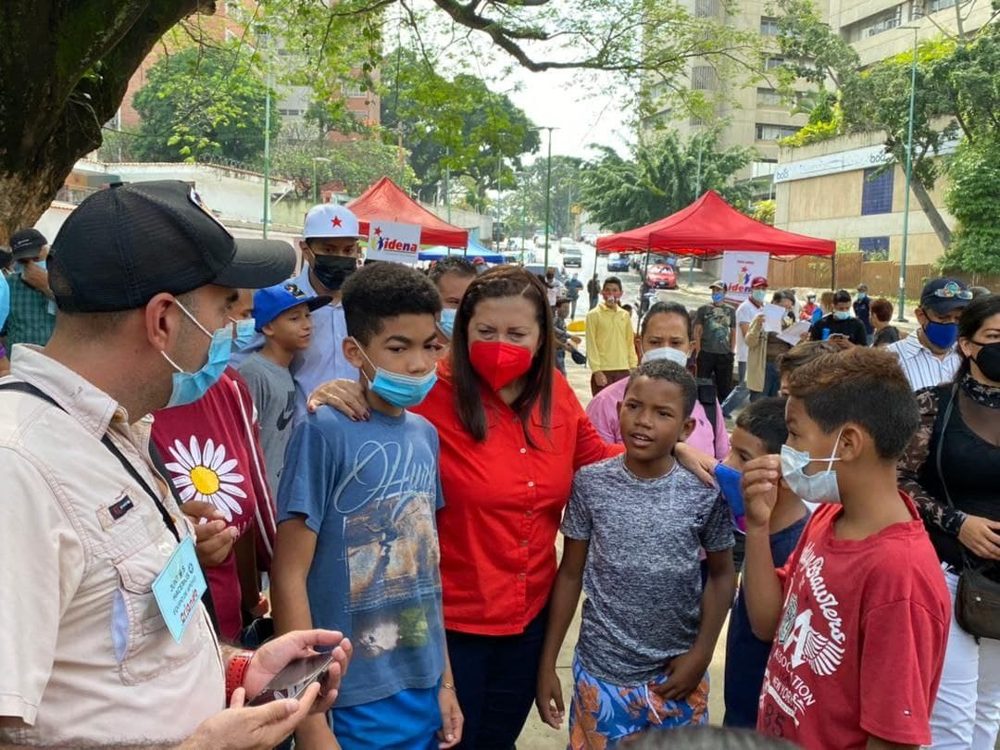
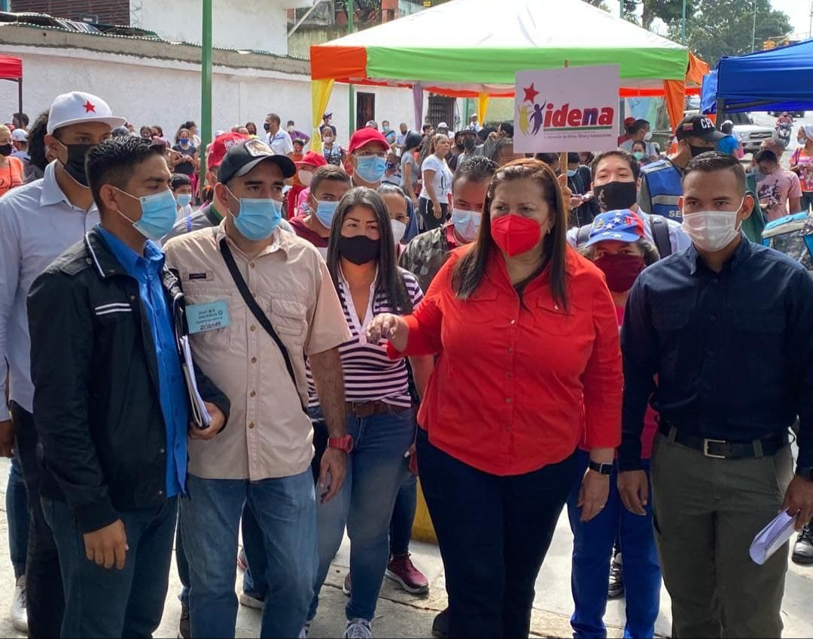
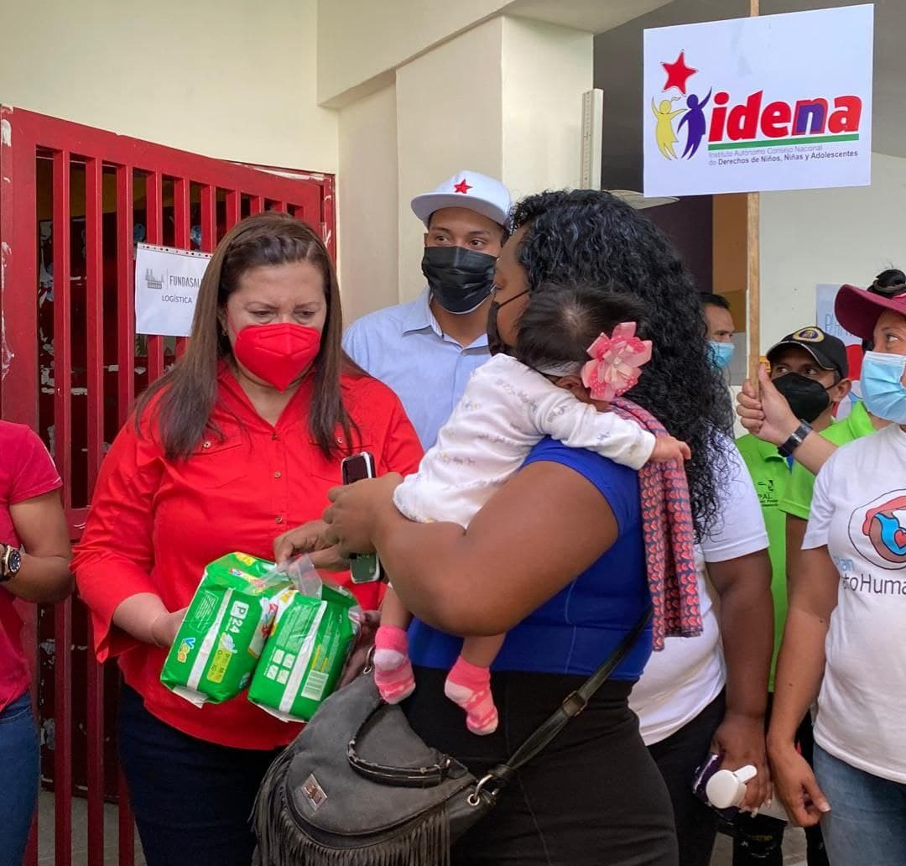

Hoy desde la Parroquia San Bernardino el IDENNA dijo presente en la Jornada de Atención Social orientada por la Almiranta Carmen Meléndez Candidata del GPPSB a la Alcaldía de Caracas. 

Esta jornada forma parte de la ofensiva social que lleva acabo la Vice Presidencia Social del Gobierno Bolivariano, que busca potenciar la eficiencia de las diferentes instancias de cara al cierre del año 2021.

El IDENNA a través de sus diferentes programas se encuentra desplegado a lo largo y ancho del territorio nacional con la campaña IDENNA Contigo y con el Plan de Crianza Amorosa, consolidando así una gestión que tributa a alcanzar la mayor felicidad posible en el pueblo Venezolano.

**Fuente: Prensa IDENNA**
