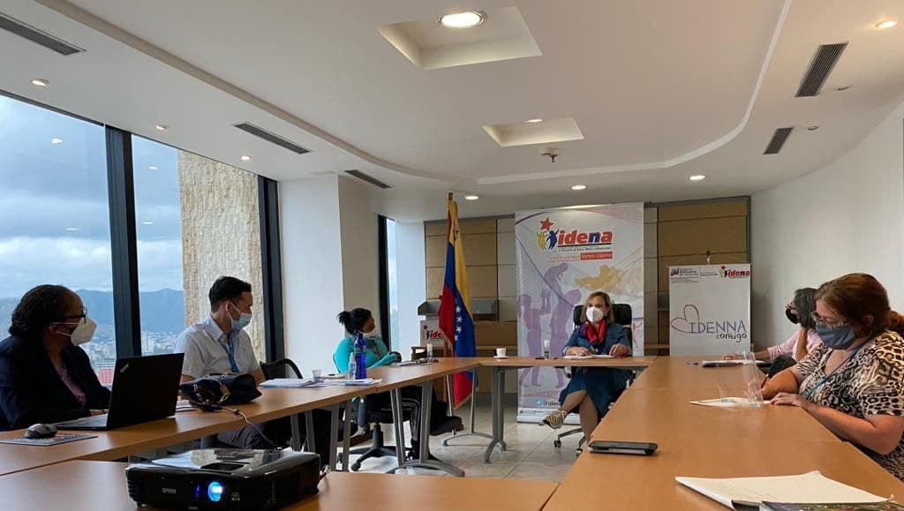
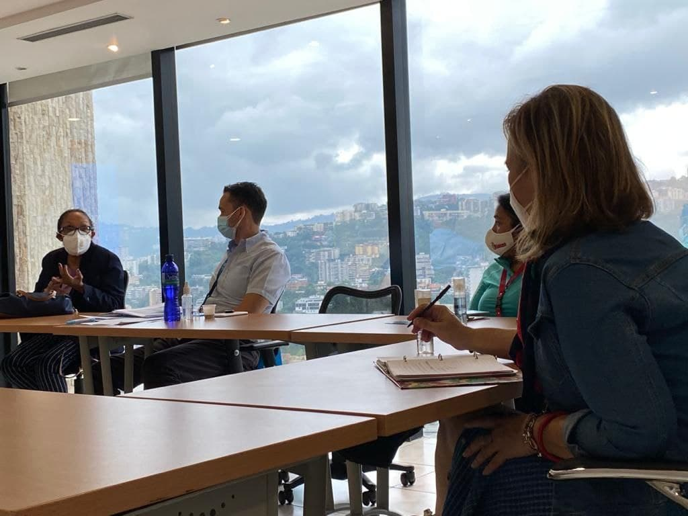

Hoy martes 05 de octubre se realizó en las instalaciones de la Sede Principal del IDENNA la *1° Reunión sobre la Construcción y Revisión de Indicadores de Protección a la Niñez*, con la presencia de la presidenta de la institución la Dra Luisaura Ravicini y con la participación de representante de UNICEF, en el marco de cooperación internacional; Esta actividad busca establecer mecanismos o herramientas cuantitativos y cualitativos como lo son los indicadores, que contribuyan al fortalecimiento y generación de políticas públicas social adaptadas a las nuevas realidades, específicamente en materia de protección de la niñez y la adolescencia, donde interviene el IDENNA como ente rector en esta materia.

Desde el IDENNA se planteó la necesidad de generar  un Sistema de Estadística Nacional de Indicadores relevantes de prevención y protección a la infancia y la adolescencia,  que permita la consolidación de  toda la información que se produce en las diferentes instancias del Estado en materia de niñez y adolescencia, que indique la realidad en cuanto a la cuantificación de las políticas públicas y de inversión social del Estado Venezolano, así como generar la fuente oficial de respuesta cuando sea requerido en el momento oportuno.

De igual forma el  IDENNA como ente responsable en materia de derechos de niños, niñas y adolescentes, estableció la construcción de nuevos indicadores, que permitan coadyuvar, articular  y coordinar con otras instituciones gubernamentales que también generen políticas en la materia, la medición efectiva de  las necesidades de nuestra infancia a través de un sistema de indicadores adaptado a la demanda del Estado, contribuyendo así  a la cuantificación de las políticas públicas de protección integral a la niñez y la adolescencia, siempre en búsqueda fortalecer las herramientas estadísticas dirigidas a la calidad de atención y bienestar social de la niñez en nuestro país.

**Fuente: Prensa IDENNA**
