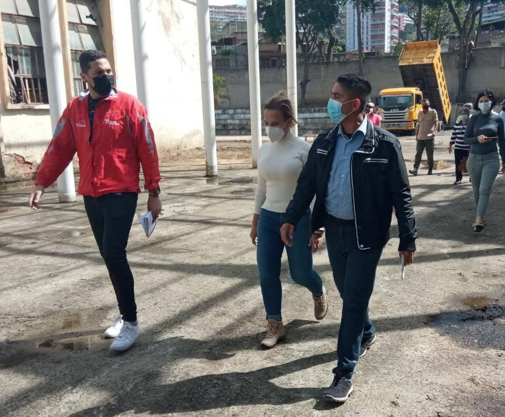
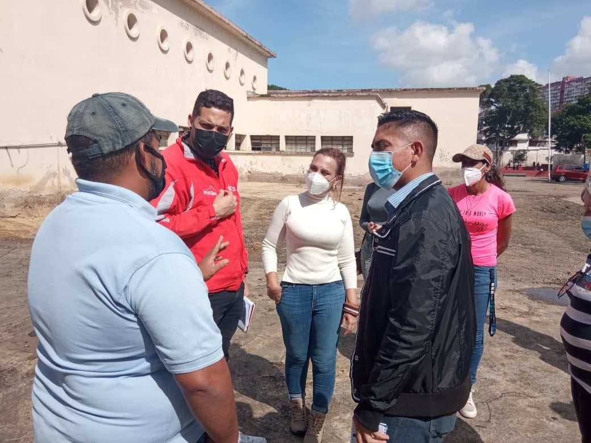
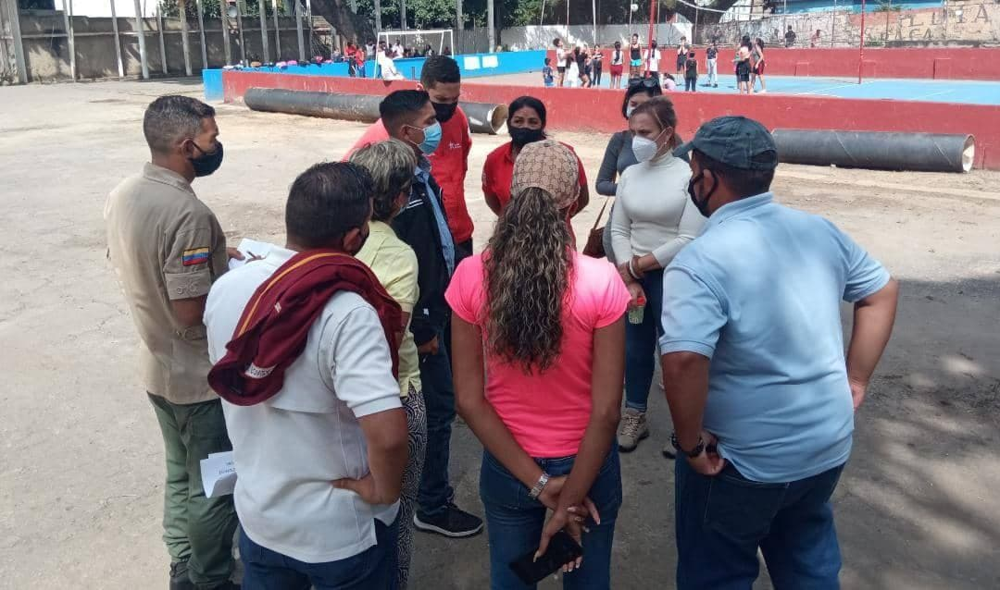

El día de ayer 06 de octubre la Dra. Luisana Rabicini Presidenta del IDENNA, en conjunto con su equipo técnico, se desplegó por la Parroquia Sucre Sector Propatria, específicamente en los espacios de la Casa del Obrero, afinando los detalles para lo que será la Mega Jornada de Atención Integral para el Poder Popular que se llevará a cabo este Viernes 08 de octubre en los ya referidos espacios. 

Dicha actividad se desarrollara en el marco de la agenda de despliegue de la candidata del GPPSB para la Alcaldía del Municipio Bolivariano Libertador Almiranta Carmen Meléndez.

Se prevé  que en esta jornada se atiendan mas de 500 niños y niñas del punto y círculo  y de comunidades aledañas con actividades recreativas y de atención en materia de salud y nutrición. Así mismo el IDENNA garantizará para esta Jornada un espacio dirigido a la Orientación Familiar a través de los COF (Centros de Orientación Familiar); de igual manera se contará con un Punto de Atención en materia de Defensoría de Niños, Niñas y Adolescentes, todo ello como parte de la Campaña de Avanzada Social IDENNA Contigo, donde el Plan de Crianza Amorosa representa el  primer eslabón  de lucha de la institución.

Esta jornada forma parte de una serie de iniciativas impulsadas por la candidata del Gran Polo Patriótico Simón Bolívar a la Alcaldía de Caracas, que tienen como objetivo principal garantizar la atención al pueblo como parte de su  compromiso con la ciudad de Caracas. 

**Fuente: Prensa IDENNA**
