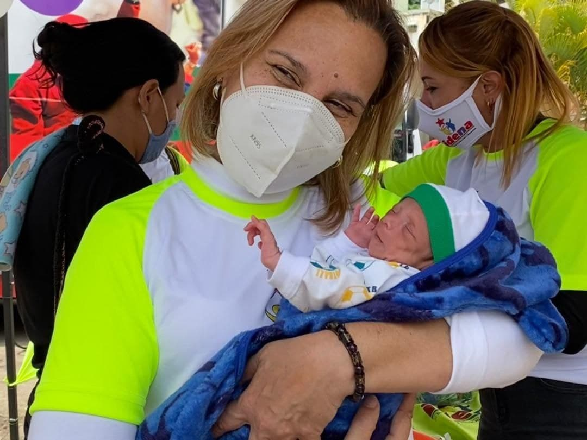
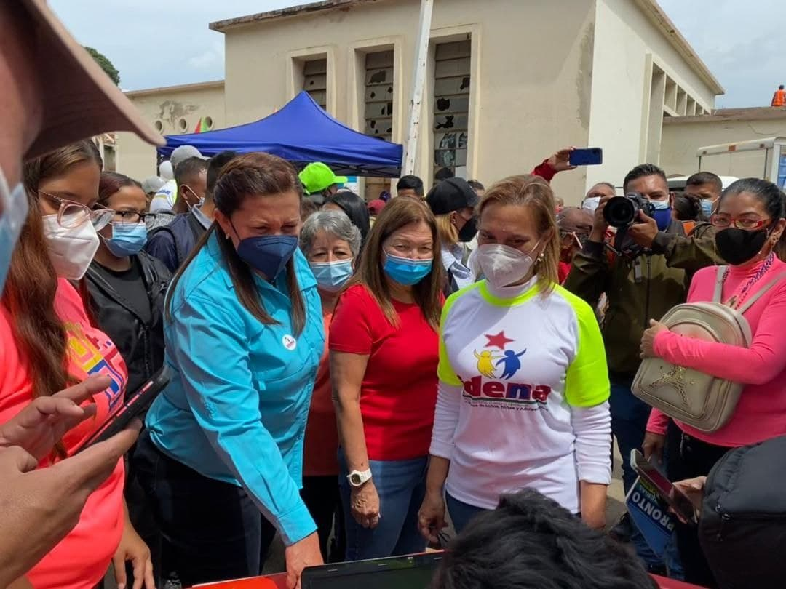
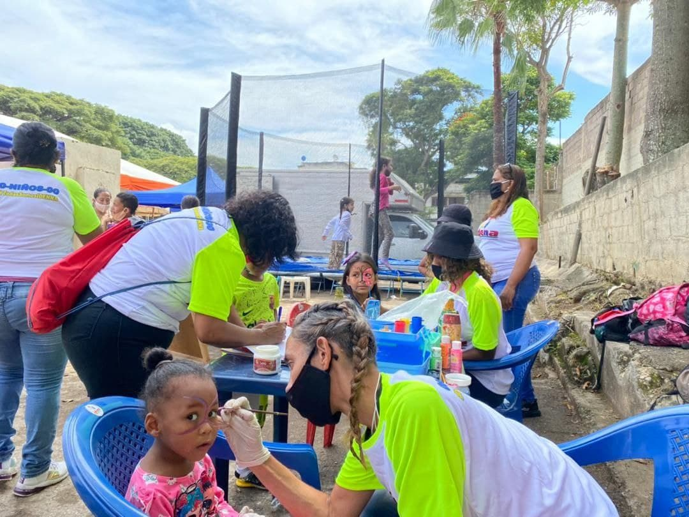

El día 08/10/2021, el IDENNA se hizo presente en la Mega Jornada de atención integral en la Casa del Obrero Sector Propatria de la Parroquia Sucre de la ciudad de Caracas.

Esta jornada como parte de la iniciativa promovida por la Candidata del GPPSB para la Alcaldía del Municipio Bolivariano Libertador Almiranta Carmen Meléndez, se desarrolló con el propósito de brindarle atención integral a la población vulnerable de la zona y comunidades vecinas, es por ello que el IDENNA se desplegó en esta Mega Jornada, con  un equipo multidisciplinario junto a su presidenta Dra. Luisaura Ravicini, dándole a conocer a la población los planes y programas sociales orientados desde la institución como medidas de protección a nuestra niñez y adolescencia así como en materia de Defensoría de niños, niñas y adolescentes.  

La presidenta de la institución, resaltó la importancia de cumplir con el compromiso adquirido, de continuar construyendo el Semillero de la Patria, a través del abordaje a las familias, mediante el Plan de Crianza Amorosa, plan creado para garantizar la atención de forma integral a la familia, fortaleciéndola en valores sociales de convivencia y cooperación mutua, es por ello que en esta jornada se realizó un circuito sobre el acompañamiento que debe efectuarse al niño y niña  desde su concepción, nacimiento y en todo su proceso de crecimiento.

Asimismo como parte de las actividades recreativas que se desarrollaron, de igual forma se hizo entrega de Material Deportivo al Grupo de niños, niñas y adolescentes  Waraira Propatria.   

**Fuente: Prensa IDENNA**
