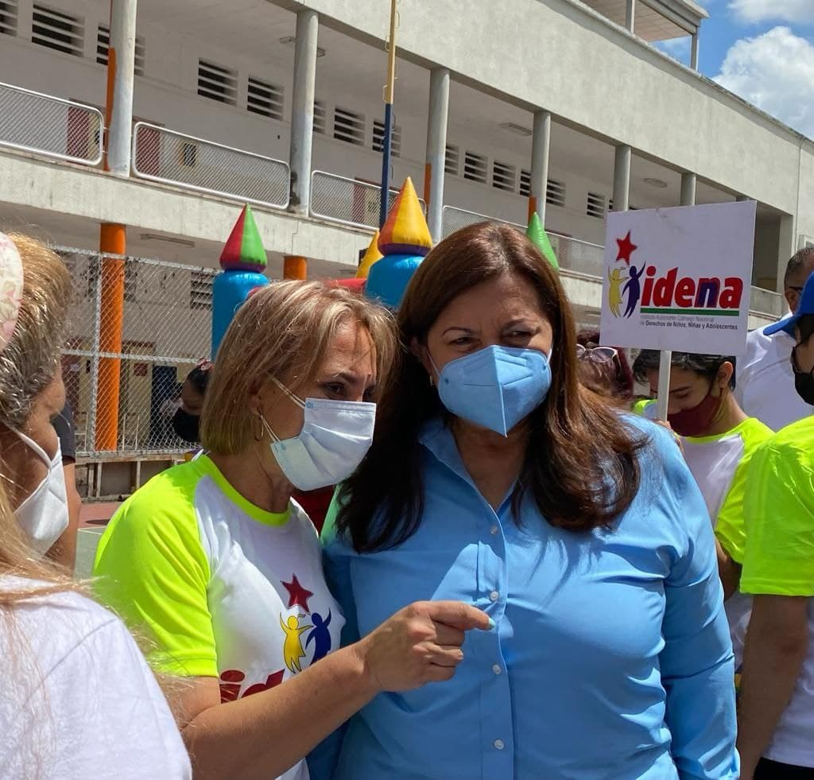

Hoy viernes 15 de octubre de 2021, el IDENNA se mantiene desplegado con las Jornadas Integrales de Atención en la ciudad de Caracas, esta vez específicamente en Liceo Andrés Bello en la parroquia La Candelaria, dónde la institución dió a conocer la campaña de avanzada social IDENNA Contigo.

Esta jornada se realizó como parte del compromiso con las labores encaminadas en la ciudad por la Candidata del GPPSB  para la Alcaldía del Municipio Bolivariano Libertador Almiranta Carmen Meléndez, con el propósito de brindarle bienestar a toda la población caraqueña, en sus comunidades y en cada rincón de las parroquias que la integran, orientados a la transformación integral de sus espacios.

El IDENNA, su presidenta la Dra. Luisana Ravicini y su equipo multidisciplinario, continúan en las calles llevándole a los ciudadanos y ciudadanas el Plan de Crianza Amorosa que tiene como basamento fundamental, la Atención Integral de la población vulnerable y de todo el núcleo familiar, con la finalidad  de minimizar los efectos negativos de la guerra económica que aún afectan a nuestro país.    

**Fuente: Prensa IDENNA**
